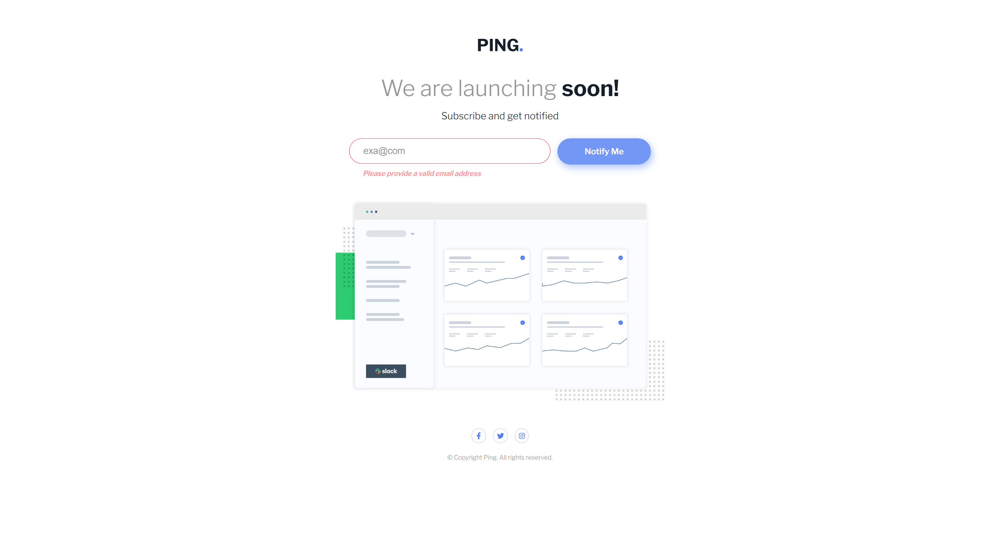

# Ping coming soon page

## Overview

Users should be able to:

- View the optimal layout for the site depending on their device's screen size
- See hover states for all interactive elements on the page
- Submit their email address using an `input` field
- Receive an error message when the `form` is submitted if:
  - The `input` field is empty. The message for this error should say _"Whoops! It looks like you forgot to add your email"_
  - The email address is not formatted correctly (i.e. a correct email address should have this structure: `name@host.tld`). The message for this error should say _"Please provide a valid email address"_

Other than expected from the project, I include some more features:

- Receive a congratulatory message when `form` is submitted successfully (and `email` is accepted). The message for this will say _"Thank you for subscribing"_
- User can submit `form` using either pressing _Enter_ key or using _button_
- User will see **Red** coloured border and outline along with error message
- User will see **Green** coloured border and outline along with accept message

### Screenshot

**Snapshot at desktop width 1440px > When email is accepted and hover over social icon**

**Snapshot at desktop width 1440px > When email is rejected and hover over button**

### Links

## My process

### Built with

- Semantic HTML5 markup
- CSS custom properties
- Flexbox
- CSS Grid
- Mobile-first workflow

### Concepts Used

Other than above, I have used many concepts.

- Outline > outline is different than border and come into scene when we click on input
- Visibility: hidden > to not show message but keep place occupied in desktop screen
- Reg-ex for email verification, DOM manipulation, preventDefault, value, trim, classList > add and remove.
- There are lots of details in project. But the confusing one it to check font-size, font-weight, color, border color of input along with padding. Many component and properties are different in mobile and desktop screen.

## Author

Meenu Soni 👨‍💻
